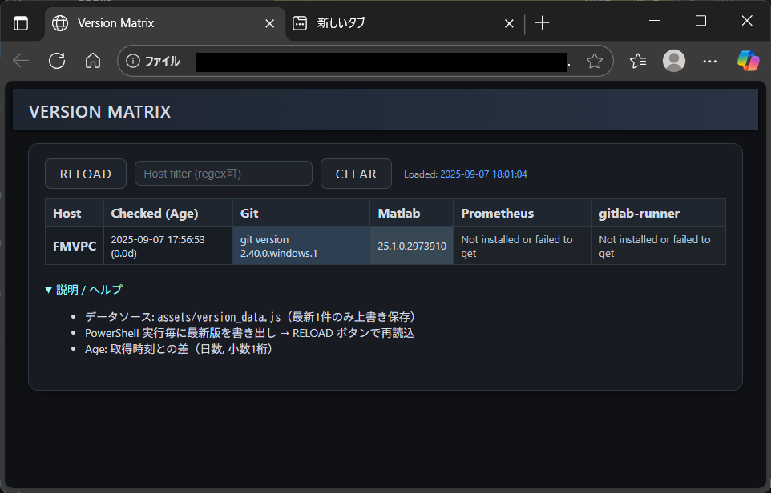
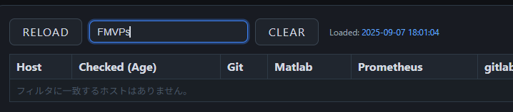

## Version Matrix / Software Version Check

シンプルな PowerShell スクリプトでローカルマシン上の主要ソフトウェア(Git / Matlab / Prometheus / gitlab-runner)のバージョンを取得し、結果を Web UI (HTML + JS) でマトリクス表示するツールです。最新 1 件のみを `assets/version_data.js` に上書き出力し、同時に単体配布可能なスタンドアロン HTML も生成します。

### 特長
- PowerShell 単一スクリプト: `check_versions_new.ps1`
- 並列ジョブで高速取得 (Start-Job)
- Matlab は `matlab -help` 出力をインライン正規表現解析
- 取得結果を JS (`window.versionMatrix`) 形式で書き出し
- 表示用 `index.html` と、配布用 `version_matrix_standalone.html` の 2 形態
- スタンドアロン HTML は CSS / JS / データを全て 1 ファイルに内包
- 取得データは常に “最新 1 件” のみ保持 (履歴肥大を防止)
- ホストフィルタ (部分一致 / 正規表現 `/pattern/` 対応)
- 取得時刻と経過日数 (Age) 表示

### ディレクトリ構成
```
softwareVersionCheck/
	check_versions_new.ps1          # 収集 & JS出力 & スタンドアロン生成
	index.html                      # 通常ビュー (外部 assets 読込)
	version_matrix_standalone.html  # 自動生成される単体配布用HTML
	assets/
		app.js                        # テーブル描画 / フィルタ / 色付け
		styles.css                    # UI スタイル
		version_data.js               # 最新 1 件のデータ (生成物)
	getMatlabVersion.ps1            # 旧: 外部解析用(現在は未使用 / 参考)
```

### 動作イメージ
(画像は差し替えてください)

#### テーブル表示スクリーンショット


#### フィルタ適用例



### 使い方 (通常版)
1. PowerShell を開く (必要なら ExecutionPolicy を適宜緩和)
2. リポジトリルートでスクリプト実行:
	 ```powershell
	 powershell -ExecutionPolicy Bypass -File .\check_versions_new.ps1
	 ```
3. `assets/version_data.js` が生成/更新される
4. `index.html` をブラウザで開く
5. RELOAD ボタンで手動再読込 (ファイル更新後に反映)

### スタンドアロンHTMLの利用
スクリプト実行時に `version_matrix_standalone.html` が再生成されます。これを単体で配布/メール添付/共有ドライブ配置すれば外部依存なく閲覧可能です。

### 出力データ仕様 (`window.versionMatrix`)
単一要素 (最新) の配列。例:
```javascript
window.versionMatrix = [
	{
		"timestamp": "2025-09-07 17:54:50",
		"host": "MYHOST",
		"Git": "git version 2.x.x",
		"Matlab": "25.1.0.x (R2025a) Update 1",
		"Prometheus": "Not installed or failed to get version",
		"gitlab-runner": "Version 16.x.x (abcd1234)"
	}
];
```

### フィルタ機能
- 入力例: `alpha` → 部分一致 (大文字小文字無視)
- 正規表現: `/ALPHA-NODE[0-9]+/` のように `/` で囲む
- 特殊文字を含む場合は自動的に正規表現トライ。失敗時は部分一致フォールバック

### Matlab バージョン解析
`matlab -help` 出力の中から以下優先度で抽出:
1. `MATLAB Version: <core> (R20xx[a|b]) Update N`
2. `MATLAB Version: <core> (R20xx[a|b])`
3. `Version: <core>`
取得失敗時: `Not installed or failed to get version`

### カラーリングについて
- 各セル値テキストをキーに安定配色 (同じバージョンは同色)
- `Not installed or failed...` は fail クラス
- `Update` を含む場合は warn クラス (独自ルール: ここでは単に分類)

### よくある調整ポイント
| ニーズ | 対応策 |
|--------|--------|
| 履歴も残したい | 上書きではなく Append に戻し、UI 側で最新のみ抽出する処理を削除 |
| 収集対象追加   | `$softwareList` に `{ name=...; command=... }` を追加 |
| 取得フォーマット改善 | `app.js` の `shortText()` / `classify()` を調整 |
| 別環境配布      | `version_matrix_standalone.html` を配布 |

### 開発メモ
- 文字化け対策: Bundling 時に `Get-Content -Encoding UTF8 -Raw` を使用
- PowerShell での三項演算子は未使用 (if 文で代替)
- スタンドアロン生成はスクリプト末尾: CSS/JS/データを文字列結合

### ライセンス
（必要なら追記）

### 既知の制限
- 複数ホスト同時集計や SSH 越し収集は未実装（ローカル前提）
- Prometheus / gitlab-runner がパス未登録の場合は失敗扱い文字列
- Matlab 未インストール環境では起動ヘルプ呼び出しコストなし（即エラー→フォールバック）

### 次ステップ案
- 複数ホスト IP/リストを読み込んでリモート Invoke
- 履歴保持 + 日付範囲フィルタ
- Export: CSV / JSON / Markdown
- バージョングループの凡例表示
